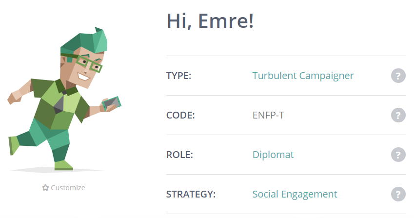

<!DOCTYPE html>
<html>
<body style="background-color:#99ffdd;">
</body>
<title>Introduction to Information Technology Profile</title>
<head>
  <meta charset="UTF-8">
  <meta name="My IT info" content="IT profile">
  <meta name="Emre" content="Emre Vatansever">
  <meta name="viewport" content="width=device-width, initial-scale=1.0">
</head>

    

      <h1 style="background-color:#248f24;font-family:verdana;">Emre Vatansever</h1>
    

     
    
     
    <b>
      <p1> Student Number:s3906416</p1>
    </b>
     
    <p2>Email: s3906416@student.rmit.edu.au </p2>

  <h2 style="background-color:#248f24;font-family:verdana;">About Me</h2>
  <b>
    <p1>My name is Emre Vatansever, I was born and raised in Melbourne Australia, I currently live in the Northern suburb of Roxburgh Park, I am fluent in the language of Turkish, as both my parents (they are Turkish) taught me at a young age, however Turkish and English are the only languages I know so far, so I am only bilingual. A few things you should know about me, I like to ride my bike whenever I need to clear my head, as it allows me to think and explore my mind as I cruise the streets, I also like to listen to music, I am a big fan of 90s and 2000s hip hop, however I do try to expand my taste in music often, my favourite song at the moment to listen to would be “Juicy” by the Notorious BIG, as the soundtrack is very chill and the lyrics motivate me to work harder and smarter day by day.</p1>
  </b>

  <h2 style="background-color:#248f24;font-family:verdana;">Education</h2>
  <b>
    <p1>As for Education I studied at Ilim College for most of my Primary school, and all of my High school years, the most recent study/course i would have completed in the past year would be my VCE studies at Ilim College, and my Certificate 2 training for security at T.A.T, currently I am studying Bachelor of Information Technology at RMIT University.</p1>
  </b>

  <h2 style="background-color:#248f24;font-family:verdana;">Interests in IT</h2>
  <b>
    <p1>I was interested in computers ever since I could click the mouse on our old family desktop computer, as a child I would often get lost on our family computer, playing games and exploring the internet for what it was at the time, I specifically remember playing 3D pinball on an old school white computer with a crt screen. I would also play video games with my older brother such as Teken and Fifa, although back then I was not that good, I was still enjoying myself and have fond memories playing on his playstation 2. As I grew older I would find myself playing more video games each year, and become even more interested in the new video game consoles that would be released. Video games had been a massive part of my life growing up, and it all changed when I rediscovered PC gaming in my first year of high school, I had just heard about this MOBA that was rising in popularity at my school, so I installed it on the family computer at the time, That computer only had an intel pentium, yet it somehow was powerful enough to run the MOBA, that MOBA was league of legends, I was addicted to playing League of Legends, everyday after school I would jump straight onto the computer and play with my friends, but then I realised there is whole heap of different games I could play on computer, so I bought and downloaded CS:GO, now like I said, I only had an Intel Pentium at the time, so CS:GO would not run as well as it should have, so I did some research as to why it would not run, that was the moment I realised that I had a strong bond to technology, as I learnt about optimisation, computer parts, computer systems, software, all because I wanted to play a game I couldn’t run, that Intel pentium computer taught me how to work with what you have, and after installing faster ram and a new graphics card, allowed me to play bigger games up up until last year, which was the year I built my first gaming Pc(quarantine) which i had been saving up for over the years. After realising that the knowledge I gained from building and diagnosing computers does not come easy to others, I knew that I had to pursue my passion in computers and technology. This is why I chose to study Bachelor of Information Technology at RMIT University after finishing my VCE studies. At RMIT I expect to expand upon my current knowledge around technology, this should come easy to me as I am very passionate to learn and develop new skills that will not only help me but satisfy my curiosity to learn more.</p1>
  </b>

  <h2 style="background-color:#248f24;font-family:verdana;">Ideal Job</h2>
  <h3 style="background-color:#248f24;font-family:verdana;">Information Technolgy Technician</h3>
   
  
   
  <a href="https://www.seek.com.au/career-advice/role/information-technology-technician_2">Job Link</a>
   
  <b>
  <p1>An IT Technician is a person who has studied technology professionally in order to assist technology users. Usually IT Technicians set up Networks, look after hardware and software of the users, and respond to requests in order to have IT systems running smoothly.The Job of an IT Technician is appealing to me as I like to help people with things they are having trouble with, the world of technology is very complicated and I am willing to go the extra mile to understand technology to ease the experience on inexperienced users.IT Technicians need to understand and know what they are doing, they cannot just start diagnosing problems without knowing background knowledge on the subject, this means that either IT technicians need to conduct research and gain experience via their own projects, or study IT at a school or course. Currently I am very experienced in the hardware side of technology, as in the past i have taken apart computers and also built computers for friends and myself, I am also very good at diagnosing problems related to hardware such as faulty power supplies, weak processors, not enough storage etc, as I had to use a budget computer for the longest time, this is another reason I want to become an IT technician, as I want to show users the potential low budget technology can accomplish when they are taken care of.I plan on gaining experience to become an IT technician by studying bachelor of Information Technology at RMIT, however nothing beats real world experience, so as a hobby I will help family and friends with trouble they are having with their technology.</p1>
</b>

  <h2 style="background-color:#248f24;font-family:verdana;"> Personal Profile </h2>
  <h3 style="background-color:#248f24;font-family:verdana;"> 16personalities Test</h3>
   
  
   
  <a href="https://www.16personalities.com/profile">16personalities profile</a>
   
  <b>
  <p1>After taking the 16 personality test, I felt as if the results were somewhat believable, the result I got was ENFP-T The Campaigner,  as a campaigner I trust that I will encourage my team members to do their best regardless of their current situation, I also feel I choose groups of people that aspire to be something part of the bigger picture. Nevertheless I do believe that the 16 personality test should be taken with a grain of salt as personalities can change based on a person's current situation or mood.</p1>
</b>
  <h3 style="background-color:#248f24;font-family:verdana;">Learning style</h3>
   
  
   
  <a href="http://www.educationplanner.org/students/self-assessments/learning-styles-quiz.shtml?event=results&A=7&V=8&T=5">Learning Style Test</a>
   
  <b>
  <p1> My learning style result was visual learner, this is somewhat true as I mostly learn by watching others actions, however I do sometimes learn via hands on tasks, I learnt how to build computers by watching linus tech tips, however I learnt new skills through my own harmless errors while actually building a computer, such as cable management and aesthetic.</p1>
</b>
  <h3 style="background-color:#248f24;font-family:verdana;"> Psychopath Test</h3>
   
  
   
  <a href="http://psychopath.channel4.com/quizzes.html">Test</a>
   
  <b>
  <p1>I am only 45% psycho</p1>
</b>

  <h2 style="background-color:#248f24;font-family:verdana;"> Project Idea</h2>
   
  <h3 style="background-color:#248f24;font-family:verdana;"> Advertisement Website</h3>
  <p1>I plan on creating a website similar to YouTube, however instead of funny videos of cats doing crazy things, there are going to be videos/sources of advertisements, advertisements for things such as businesses, fundraisers, products, upcoming events, upcoming projects, houses, land and much more. This website will have a commenting system where people can voice their opinions on the advertisement, they can also rate the advertisement based on their experience, also the website will have different categories for different types of advertisements, as someone could be looking for a plumber, they can define that they only want to see plumber related advertisements, this website will have an account system where users can register, this will allow them to either post or interact with advertisements, and to regulate bad behaviour, a verification check and report process will be implemented.</p1>
  <h3 style="background-color:#248f24;font-family:verdana;">Motivation</h3>
  <p1>The main reason why I want to create a website that only focuses on advertisements, is so that users have a single source they can use to find a multitude of different things, this will eliminate hours wasted searching for specific resources the user needs, this will also boost competitiveness between rivals, as the publicity of rivals will be shared on the same platform, thus boosting their motivation to create advertisements that appeals to users needs better, also publishers that upload advertising on this website will not have to worry about their video being overviewed by a video of a cat playing piano, all they have to worry about is other advertisers which eliminates some of the competition.</p1>
  <h3 style="background-color:#248f24;font-family:verdana;">Description</h3>
  <p1>The website will have a main homepage similar to YouTube, a bunch of videos will be recommended to the user based on their previous searches, or there will be a suggestion of videos based on what videos are popular, this will allow the user to explore various amounts of products and services, there will be a very specific category list detailing what the user would like to search for, and if the user cannot find what they are looking for there will be a suggestion feature in which they can directly communicate with a moderator or  website developer(me), there will be an option to sign in or register to the website, this therefore will allow the user to unlock more features on the website, such as commenting, uploading, rating, reporting and possibly more if the website expands, the website might have a feature where people can order certain products from manufacturers, however this may be a little complicated and unsafe as it would be preferred that the products are bought directly from the manufacturer/provider. The video viewing interface will have a rating system such as a like and dislike feature which can only be interacted with by registered users, it will also have a comment section so registered users can express their views, users that make good content and have proven that they are who they say they are will get a verification symbol to let other users know they mean business, this will allow for a safer online experience to those who might not trust others, as mentioned there will be a reporting system, people who make misleading content or misleading comments will be dealt with through user reports, if a person is reported they will be reviewed by a moderator and will be dealt with accordingly, they will be banned if the report has sufficient information that the user was misusing the website they will be penalised via a temporary or permanent ban which will not allow them to interact with with the website, such as uploading, commenting or rating. Moderator will be people that either volunteer to be moderators and will be selected on good behaviour, or will be hired workers, both of which will follow guidelines given to them in order to control the behaviour of users on the website, moderators will be accessible via a chat in which users can send a message during working hours, or send a ticket during after hours so that their queries and concerns can be dealt with on a professional level. If an advertisement is very popular amongst people it will be put into a top advertisement category to gain further publicity, this will reward those publishers who worked hard to make such a good advertisement, this will encourage publishers to work harder in order to gain that extra publicity, as publicity usually leads to higher sales. The website's aesthetic will remain the same however, the website might change during events, such as christmas, this will give the user a different viewing experience, and maybe in the future the website will have a feature where the user can choose their own theme and customise how the website will look to them.</p1>
  <h3 style="background-color:#248f24;font-family:verdana;">Tools Required</h3>
  <p1>The tools required to allow this website to become successful will be, a server so that the website can constantly run so that users can access the website, coding languages will be required such as html, css, javascript, python, etc depending on the state of the website, also advertisers will be required in order to deliver content to the website, as without content the website is quite useless, obviously a running computer with a keyboard and mouse will be required in order to develop the website, finally beta testers will be required to test the integrity and the usability of the website.</p1>
  <h3 style="background-color:#248f24;font-family:verdana;">Skills</h3>
  <p1>The skills required in order to allow this project to run smoothly would be to be able to build a server computer, to be able to make a server that can run the website, knowledge of coding languages appropriate to what is needed in order to allow the website/project to be accomplished, programming skills can be developed fairly easily if time is spent studying them for free online, the server can be acquired through a simple computer build, an old computer can be used, a new one can be built, or a server can be rented for a period of time.</p1>
  <h3 style="background-color:#248f24;font-family:verdana;">Outcome</h3>
  <p1> If this website is successful it will help many people find the product/service they are looking for, it will allow publishers to become well known, and it will possibly revolutionize the industry of advertising, once the website is well established it will allow me to gain revenue via sponsorships, either that or this idea completely fails and I have to start working on another idea to make me rich.</p1>

<body>
  <h1 style="background-color:#248f24;font-family:verdana;"> References </h1>
  <p1> W3schools.com. 2021. W3Schools Online Web Tutorials. [online] Available at: https://www.w3schools.com/ [Accessed 28 March 2021].
</html>
